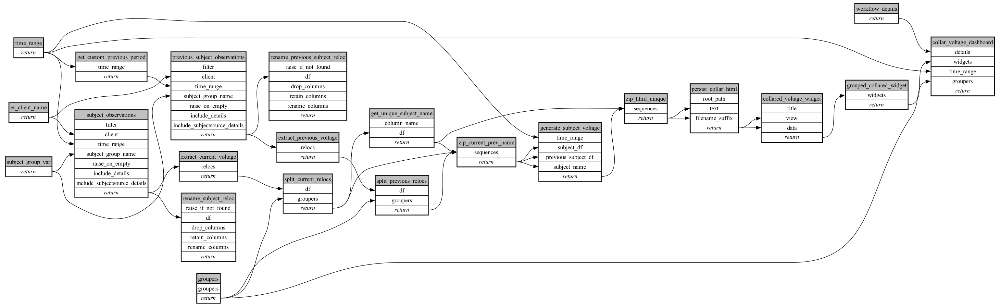

```
# AUTOGENERATED BY ECOSCOPE-WORKFLOWS; see fingerprint in README.md for details

```

```yaml
# fingerprint:
artifacts_sha256_basic: c5318525ac30b3d4ab56cf644758f9b09b33b3c77955166ab55c2d438f0c956c
artifacts_sha256_strict: ff45aaeefbf14ea3459808762304064e90aa0e854b629cc8715da2077cf73b10
installed_requirements:
- channel: https://repo.prefix.dev/ecoscope-workflows/
  name: ecoscope-workflows-core
  version: {version: ==0.22.17}
- channel: https://repo.prefix.dev/ecoscope-workflows/
  name: ecoscope-workflows-ext-ecoscope
  version: {version: ==0.22.17}
- channel: https://repo.prefix.dev/ecoscope-workflows-custom/
  name: ecoscope-workflows-ext-custom
  version: {version: ==0.0.40}
- channel: https://repo.prefix.dev/ecoscope-workflows-custom/
  name: ecoscope-workflows-ext-ste
  version: {version: ==0.0.18}
- channel: https://repo.prefix.dev/ecoscope-workflows-custom/
  name: ecoscope-workflows-ext-mnc
  version: {version: ==0.0.7}
- channel: https://repo.prefix.dev/ecoscope-workflows-custom/
  name: ecoscope-workflows-ext-big-life
  version: {version: ==0.0.8}
- channel: https://repo.prefix.dev/ecoscope-workflows-custom/
  name: ecoscope-workflows-ext-mep
  version: {version: ==0.0.13}
params_sha256: 8450d60067d99f74a2156be90bb9fcced67048a9d4ee0b703e5484446bec5b7b
spec_sha256: ab4fbe7ab24305bf92727f32c2a94df0a463771c2fb15eec5d0bfe15222b356b

```

# ecoscope-workflows-collar-voltage-workflow


