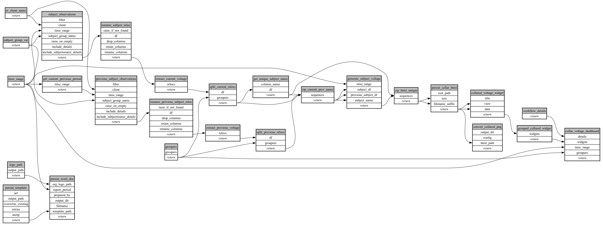

```
# AUTOGENERATED BY ECOSCOPE-WORKFLOWS; see fingerprint in README.md for details

```

```yaml
# fingerprint:
artifacts_sha256_basic: 9d31120a2f6fbb2f85b578447c9ba1c727a73a69e50572c27e5c534c78a62a25
artifacts_sha256_strict: ea14bd3220bdc3d3915c7b9b3d6b66e59eeb91464f10b973c39ed161a72b1acd
installed_requirements:
- channel: https://repo.prefix.dev/ecoscope-workflows/
  name: ecoscope-workflows-core
  version: {version: ==0.22.18}
- channel: https://repo.prefix.dev/ecoscope-workflows/
  name: ecoscope-workflows-ext-ecoscope
  version: {version: ==0.22.18}
- channel: https://repo.prefix.dev/ecoscope-workflows-custom/
  name: ecoscope-workflows-ext-custom
  version: {version: ==0.0.45}
- channel: https://repo.prefix.dev/ecoscope-workflows-custom/
  name: ecoscope-workflows-ext-ste
  version: {version: ==0.0.19}
- channel: https://repo.prefix.dev/ecoscope-workflows-custom/
  name: ecoscope-workflows-ext-mnc
  version: {version: ==0.0.8}
- channel: https://repo.prefix.dev/ecoscope-workflows-custom/
  name: ecoscope-workflows-ext-big-life
  version: {version: ==0.0.11}
- channel: https://repo.prefix.dev/ecoscope-workflows-custom/
  name: ecoscope-workflows-ext-mep
  version: {version: ==0.0.15}
params_sha256: a932f1424db29bb46cec20faa2a6d5bdc80607078208a51a68eeb69ced9ce744
spec_sha256: 59c0429c4ec3f38d5dc97f355a3a8e6029a6a8e55a72d606ef61ff4e5eb1f0ce

```

# ecoscope-workflows-source-voltage-workflow


