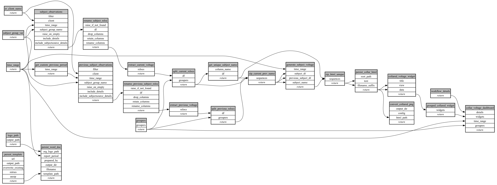

```
# AUTOGENERATED BY ECOSCOPE-WORKFLOWS; see fingerprint in README.md for details

```

```yaml
# fingerprint:
artifacts_sha256_basic: b0f2be967704490c8e008049efe4ae35fcc7d98fd02de4800d60fb52eaf39b1f
artifacts_sha256_strict: 470dd75672d0cddc9334fe7ac4637d2ebb30c12d74ef47ad2a612529a3aadbaa
installed_requirements:
- channel: https://repo.prefix.dev/ecoscope-workflows/
  name: ecoscope-platform
  version: {version: ==2.15.1}
- channel: https://repo.prefix.dev/ecoscope-workflows-custom/
  name: ecoscope-workflows-ext-custom
  version: {version: ==0.1.0rc14}
- channel: https://repo.prefix.dev/ecoscope-workflows-custom/
  name: ecoscope-workflows-ext-ste
  version: {version: ==0.0.0rc1}
- channel: https://repo.prefix.dev/ecoscope-workflows-custom/
  name: ecoscope-workflows-ext-mep
  version: {version: ==1.0.1}
- channel: conda-forge
  name: pydeck
  version: {version: ==0.9.2}
- channel: conda-forge
  name: opentelemetry-sdk
  version: {version: ==1.44.0}
params_sha256: 175752c35cedd62e6f4371acdfe83ac9fbc125363cbaa76616a1f2ffdfe0ace1
spec_sha256: 6bf18ac657f39453d1aa48de83bda4437f39267688d7f274f3706727a852b9d1

```

# ecoscope-workflows-source-voltage-workflow


